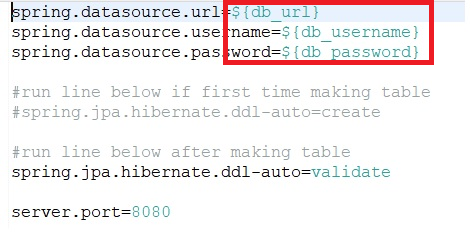
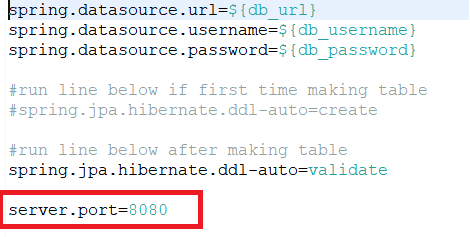
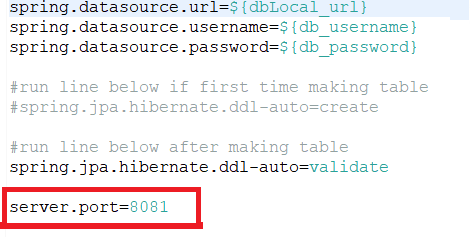
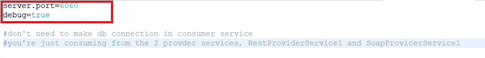

# Riot Games API

## Project Description 
- An API that provides character data from 2 provider APIs being consumed by 1 consumer API.
- LOLChampionProviderRestAPI
	- A RESTful API that provides character data from the game League of Legends.
- ValoAgentProviderSoapAPI 
	- A SOAP API that provides character data from the game Valorant.
- GameConsumerRestAPI
	- A RESTful API that is consuming LOLChampionProviderRestAPI and ValoAgentProviderSoapAPI.

## Technologies Used
- Java - Version 1.8
- Spring Boot - Version 2.6.7
- Spring Web - Version 2.6.7
- Spring Data JPA - Version 2.6.4
- PostgreSQL - Version 42.3.4
- SL4J - Version 1.7.36
- Spring Tool Suite - Version 4.14.0.RELEASE
- Postman - Version 9.19.0
- DBeaver - Version 22.0.3.202204170718

## Features
Some features of the project.
- Can make an http request to the Rest Provider Service to get the list of League of Legends Champions and their descriptions from the Game consumer API.
- Can make an http request to the Soap Provider Serivce to get the list of Valorant Agents and their descriptions from the Game consumer API.
- Can make an http request to to the consumer API to update, delete or create League of Legends Champions or Valorant Agents from the Game consumer API.
   
To-do list
   
- Improve unit testing.
- Design better API design for the consumer API.
- Improve logging to log relevant actions.

## Getting Started   
    
1. clone the project in a new folder of your choice.    
` git clone https://github.com/Ben-Ortiz/Riot-Games-API.git `     
2. edit the application.properties file in src/main/resources to connect to either an aws database or local db for LOLChampionProviderRestAPI and ValoAgentProviderSoapAPI.   
   
3. edit the port numbers of LOLChampionProviderRestAPI, ValoAgentProviderSoapAPI, and GameConsumerRestAPI to different ports as shown below.    
  
  
  
4. Run the 3 programs, LOLChampionProviderRestAPI, ValoAgentProviderSoapAPI, and GameConsumerRestAPI.   
5. Add some dummy data in your aws db, or local db using DBeaver.   
5. Run Postman to get ready to test your endpoints.   

## Usage  
  
These are the endpoints that are supported in the program.   
For LOLChampionProviderRestAPI,   
POST: http://localhost:8080/leagueOfLegends/postChampion,   
GET: http://localhost:8080/leagueOfLegends/champions,   
GET: http://localhost:8080/leagueOfLegends/champions/1,   
PUT: http://localhost:8080/leagueOfLegends/champions/1,   
DELETE: http://localhost:8080/leagueOfLegends/champions?id=5.   
   
For ValoAgentProviderSoapAPI, a Soap API you need to provide a body formatted raw, and in XML and you can only do post requests.    
To easily test this Soap Service use SOAP UI instead of Postman to make requests to this Soap Service.     
First you need to get the WSDL URL.   
To get that you need to go to this url:    
` http://localhost:8081/soap-service `

   
   
## What I learned
- Spring Data JPA: How to create models and use Spring to make database tables in Postgres
- Rest API: How to create a Rest API using the Spring Framework.
- Soap API: How to create a Soap API using the Spring Framework.
- Postman: How to make requests to a Rest API and Soap API.

## What I can improve on
- Testing: Spring Test could be used more
- Logging: Spring AOP could have been more descriptive.